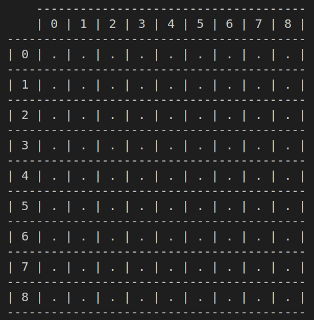
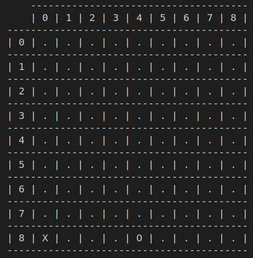
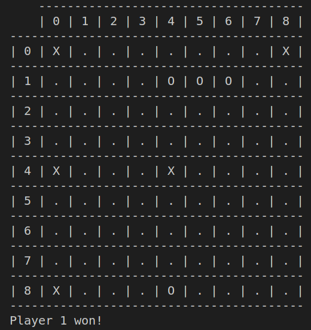
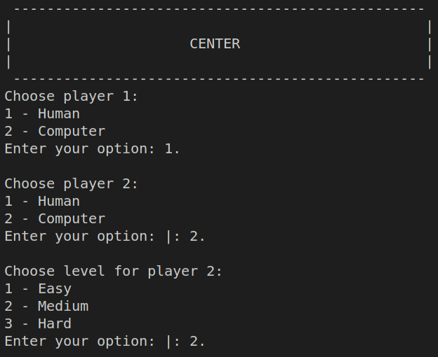
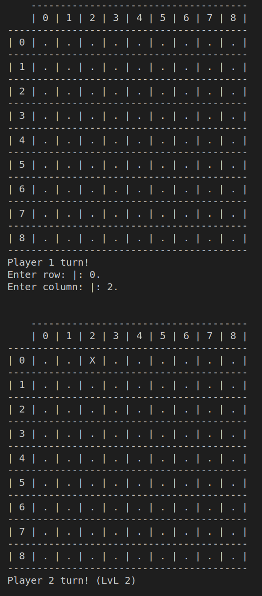

# PrologGame
Game: Center  
Group: Center_3   

João Ricardo Ramos Alves (up202007614) - 60%  
Pedro Miguel Magalhães Nunes (up202004714) - 40%


## Installation and execution  

The only software required to run this project is SICStus Prolog 4.7.1.

```
sicstus -l proj.pl
```

Run the predicate play/0 to enter the main menu and start playing.  

```
?- play.
```


## Game description  

- Center can be played in a 9x9 board (or similar - chess board(8x8) has 9x9 intersections, therefore can be used).    
- Players take turns placing one piece at a time.  
- A piece placed N steps away from the perimeter must have at least N friendy pieces in sight.  
- On a square board, pieces see in 8 directions.  
- The winner is the player who places a piece on the center of the board.  

## Game Logic  

### Internal representation of the state of the game  

The game state is composed of the current state of the board and the information of player's 1 and 2.  

- The board is represented as a list of lists (9x9). Each list represents a row on the board, and each list element represents a board cell. A cell is represented as an atom, indicating if ther is a piece placed, and which player has placed it (0 - empty cell; 1 - placed by Player 1; 2 - placed by Player 2).  

- The players are represented by a predicate player/3, which carries information on the player's type (human or computer), number (1 or 2) and level of difficulty (0 for human, 1, 2 or 3 for computer).  

`Initial State`  

```
player(computer, 1, 3),
player(computer, 2, 1).
```  

```
[[0,0,0,0,0,0,0,0,0],
[0,0,0,0,0,0,0,0,0],
[0,0,0,0,0,0,0,0,0],
[0,0,0,0,0,0,0,0,0],
[0,0,0,0,0,0,0,0,0],
[0,0,0,0,0,0,0,0,0],
[0,0,0,0,0,0,0,0,0],
[0,0,0,0,0,0,0,0,0],
[0,0,0,0,0,0,0,0,0]].
```  

  

`Intermediate State`  

```
player(computer, 1, 3),
player(computer, 2, 1).
```  

```
[[0,0,0,0,0,0,0,0,0],
[0,0,0,0,0,0,0,0,0],
[0,0,0,0,0,0,0,0,0],
[0,0,0,0,0,0,0,0,0],
[0,0,0,0,0,0,0,0,0],
[0,0,0,0,0,0,0,0,0],
[0,0,0,0,0,0,0,0,0],
[0,0,0,0,0,0,0,0,0],
[1,0,0,0,2,0,0,0,0]].
```  

  

`Final State`  

```
player(computer, 1, 3),
player(computer, 2, 1).
```  

```
[[1,0,0,0,0,0,0,0,1],
[0,0,0,0,2,2,2,0,0],
[0,0,0,0,0,0,0,0,0],
[0,0,0,0,0,0,0,0,0],
[1,0,0,0,1,0,0,0,0],
[0,0,0,0,0,0,0,0,0],
[0,0,0,0,0,0,0,0,0],
[0,0,0,0,0,0,0,0,0],
[1,0,0,0,2,0,0,0,0]].
```  

  

### Game state view  

Regarding the display of the game, there are two focal points: displaying the menus and displaying the game being played.  

- As for the menus, the predicate **display_main_menu/0** is used to display a header for the selection menus, and **choose_player/2** **choose_level/2** display the selection menus to configure the game.  



- The state of the board is shown using **display_game/1**. This predicate makes use of various auxiliary predicates to present a clear and understandable board to the player (**display_header/0**, **display_game_aux/2**, **display_row/1**, **display_cell/1**).  

- Finally, regarding the players' information, the player currently placing a piece in the board is indicated by **choose_move/3** and the winning player is indicated by **congratulate/1**.  

  

### Moves Execution  

### List of Valid Moves  

### End of Game  

### Board Evaluation  

### Computer move  

## Conclusions

## Bibliography  

https://boardgamegeek.com/boardgame/360905/center  
https://sicstus.sics.se/sicstus/docs/4.7.1/html/sicstus/